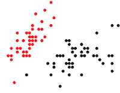

# intro to spark

Welcome to the spark tutorial!

## about me

- my name is jeremy freeeman
- i have a lab at janelia research campus
- we build a lot of tools for computing in neuroscience
- some of those tools use spark!

---

# installation

- download spark from apache.spark.org
- select 2.0.0, prebuilt for hadoop 2.7, direct download
- add PYSPARK_DRIVER_PYTHON=ipython to your bash profile

---

# starting

- navigate to your spark installation
- run ./bin/pyspark

---

# the hello world of spark

parallelize a collection of integers

```
data = sc.parallelize([1, 2, 3])
data.collect()
```

if this doesn't give you  

```
[1, 2, 3]
``` 

something is wrong!

---

# map is for manipulating

multiple each element by 2

```
data = sc.parallelize([1, 2, 3])
data.map(lambda x: 2 * x).collect()
```

should give you

```
[1 * 2, 2 * 2, 3 * 2] -> [2, 4, 6]
```

---

# when inlining isn't enough

check whether each number is less than or greater than 2

```
def robot(x):
  if x < 2:
    return 'beep'
  else:
    return 'boop'

data = sc.parallelize([1, 2, 3])
data.map(robot).collect()
```

should give you

```
['beep','boop','boop']
```

---

# reduce is for aggregating

add up all the numbers

```
data = sc.parallelize([1, 2, 3])
data.reduce(lambda x, y: x + y)
```

should give you

```
1 + 2 + 3 -> 6
```

---

# collections can be anything

make a collection of ones arrays

```
from numpy import ones

data = sc.parallelize([1, 2, 3])
data.map(lambda x: ones((x,))).collect()
```

should give you

```
[array([1.]), array([1., 1.]), array([1., 1., 1.])]
```

---

# parallelizing numpy operations

compute the sin and round

```
from numpy import sin, pi, round

data = sc.parallelize([1, 2, 3])
data.map(lamda x: pi/2 * x).map(sin).map(round).collect()
```

should give you

```
[1.0, 0.0, -1.0]
```

## this could speed things up a lot if

- the input arrays are big 
- sin was a complicated function
- but it won't always be faster!
- and see dask

---

# let's load some real data

show the first line

```
iris = sc.textFile('iris.txt')
iris.first()
```

should give you

```
u'5.1 3.5 1.4 0.2 setosa'
```

ugh...

---

# let's parse it this time

split each line on spaces

```
iris = sc.textFile('iris.txt')
split = iris.map(lambda x: x.split(' '))
split.first()
```

should give you

```
[u'5.1', u'3.5', u'1.4', u'0.2', u'setosa']
```

a little better...

---

# let's parse it all the way

split each line on spaces and make it a (string, array) tuple

```
iris = sc.textFile('iris.txt')
split = iris.map(lambda x: x.split(' '))

from numpy import array
parsed = split.map(lambda x: (str(x[4]), array(x[0:4], dtype='float')))
parsed.first()
```

should give you

```
('setosa', array([ 5.1,  3.5,  1.4,  0.2]))
```

much nicer!

---

# keys are cool

count the number of data points per species

```
counts = parsed.mapValues(lambda _: 1).reduceByKey(lambda x, y: x + y)
counts.collect()
```

should give you

```
[('versicolor', 50), ('setosa', 50), ('virginica', 50)]
```

## what was that magic?

- we started with (string, array) pairs
- we replaced each array with a 1
- we added up all the entries for each unique string

---

# spark and numpy are friends

gather all the data for setosa in an array

```
s = parsed.filter(lambda (k, v): k == 'setosa').values().collect()

from numpy import asarray
s = asarray(s)

s.shape
```

should give you

```
(50,4)
```

---

# spark and matplotlib are friends

plot the setosa data vs virginica in 2d

```
s = parsed.filter(lambda (k, v): k == 'setosa').values().collect()
v = parsed.filter(lambda (k, v): k == 'virginica').values().collect()

from numpy import asarray
s = asarray(s)
v = asarray(v)

import matplotlib.pyplot as plt
plt.plot(s[0,:], s[1,:], 'k')
plt.plot(v[0,:], v[1,:], 'r')
plt.show()
```

should give you



---

# wrap up

- Spark can be a great tool for parallelizing computation
- it's easy to integrates with the Python ecosystem
- local prototyping is easy (but can be slow)
- deploying a cluster can be a pain (but see flintrock)

## questions?